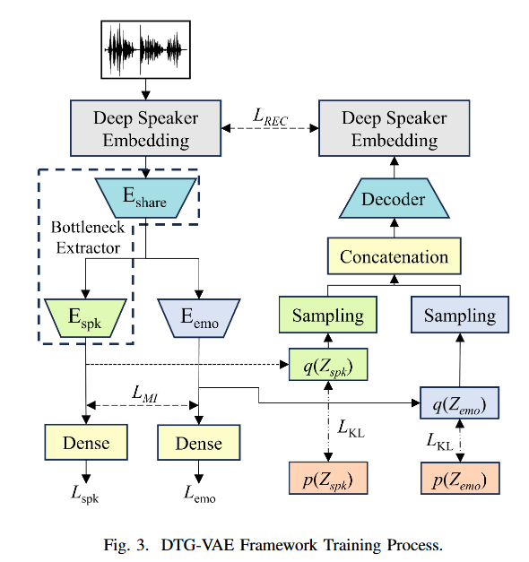
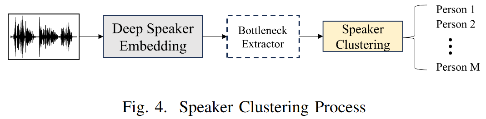
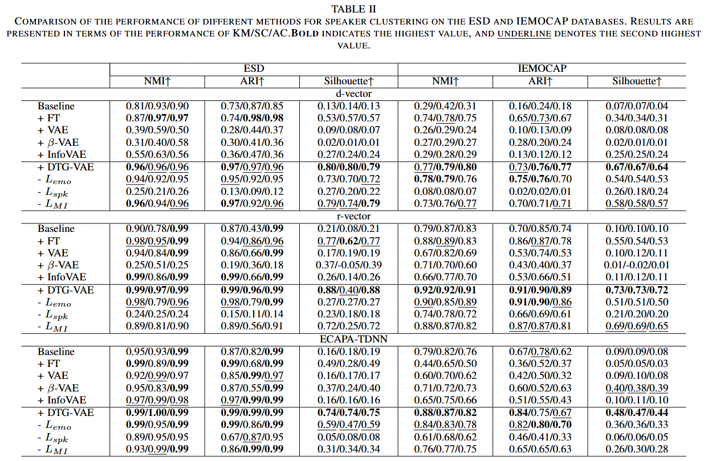
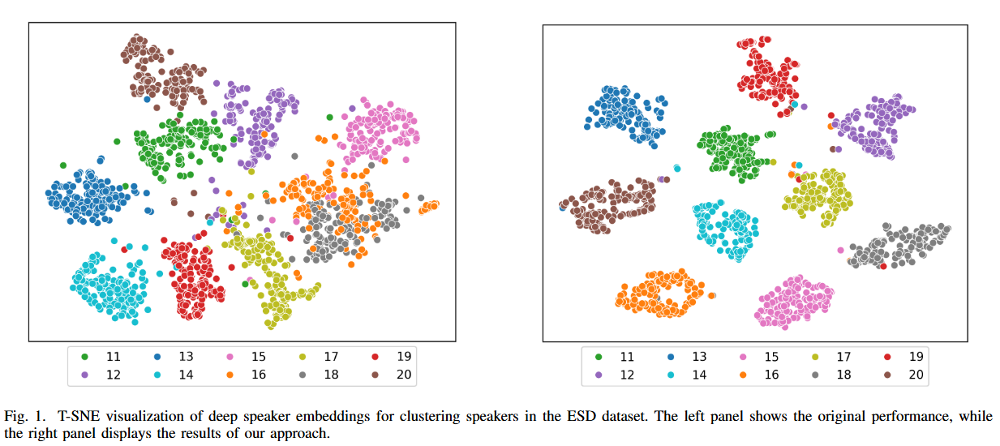
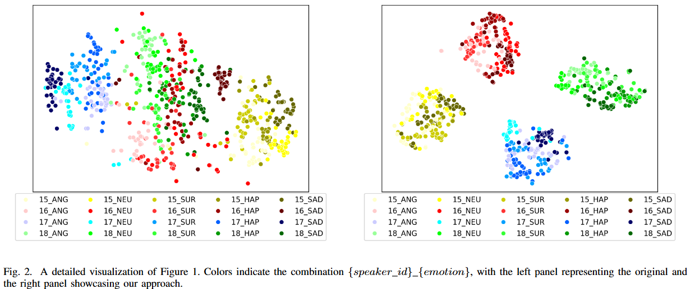

# Emotional Styles Hide in Deep Speaker Embeddings: Disentangle Deep Speaker Embeddings for Speaker Clustering
This repo is for our IEEEASRU2025 paper "Emotional Styles Hide in Deep Speaker Embeddings: Disentangle Deep Speaker Embeddings for Speaker Clustering".

## Dataset
Please download the ESD(Emotional Speech Database) dataset from [https://hltsingapore.github.io/ESD/](https://hltsingapore.github.io/ESD/) and IEMOCAP dataset from [https://sail.usc.edu/iemocap/](https://sail.usc.edu/iemocap/). Access the complete speaker embedding described in this paper through the following link [https://huggingface.co/datasets/toby28/Deep_Speaker_Embeddings](https://huggingface.co/datasets/toby28/Deep_Speaker_Embeddings).

## Pretrained Speaker Embedding Models
This project supports three types of speaker embeddings: d-vector, r-vector, and ECAPA-TDNN. For r-vector and ECAPA-TDNN, you can download pretrained models from the [SpeechBrain](https://speechbrain.github.io/) toolkit. For d-vector, please use the pretrained model provided in the official repository from [https://github.com/yistLin/dvector](https://github.com/yistLin/dvector).

## DTG-VAE Structure
<p align="center">
  
</p>
<p align="center">
  
</p>


## DTG-VAE Performance





## Citation
If this repo is useful for you, please consider citing our paper:
```
@article{lin2025emotional,
  title={Emotional Styles Hide in Deep Speaker Embeddings: Disentangle Deep Speaker Embeddings for Speaker Clustering},
  author={Lin, Chaohao and Zheng, Xu and Wu, Kaida and Xiang, Peihao and Bai, Ou},
  journal={arXiv preprint arXiv:2509.23358},
  year={2025}
}
```
